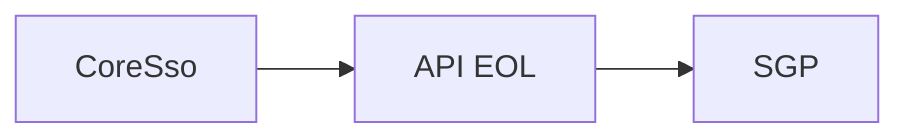

# Menus & Permissionamento

## Visão Geral

Os menus e permissionamentos são controlados da seguinte forma:
Há uma conferência de perfis & permissões entre o CoreSso e a API EOL.

Base Postgres EOL -> eol_db -> Tabela modulos. 


Os Ids são os números do enumerado Permissao.cs do SGP.




## Menus e Submenus

Os menus do SGP são montados também de acordo com os atributos dos enumerados do arquivo Permissao.cs.


O atributo "Menu" se refere a estrutura pai ao qual o item será montado, já a descrição do item esta no atributo "SubMenu".
No exemplo de menu acima 

```js title='Menu Controle de Grade'
[PermissaoMenu(Agrupamento = "Relatórios", 
    Menu = "Diário de Classe", 
    OrdemAgrupamento = 7,
    OrdemMenu = 2,
    EhSubMenu = true,
    SubMenu = "Controle de Grade",
    OrdemSubMenu = 1,
    Url = "/relatorios/diario-classe/controle-grade",
    Icone = "fas fa-print",
    IconeDashBoard = "fas fa-print",
    EhAlteracao = true)]
RCG_C = 173,
```

Desta forma temos o menu "Controle de Grade" aninhado ao menu "Diário de Classe" aninhados ao Agrupamento "Relatórios" que é a raiz do menu.

Para criação do submenu, deverá ter as seguintes condições: 

```js title='Condições para criação de Sub-Menu'
EhSubMenu = true
OrdemSubMenu = x (onde x é a ordem que o mesmo irá aparecer)
SubMenu = "Texto" (Descrição que irá mostrar no menu)
```